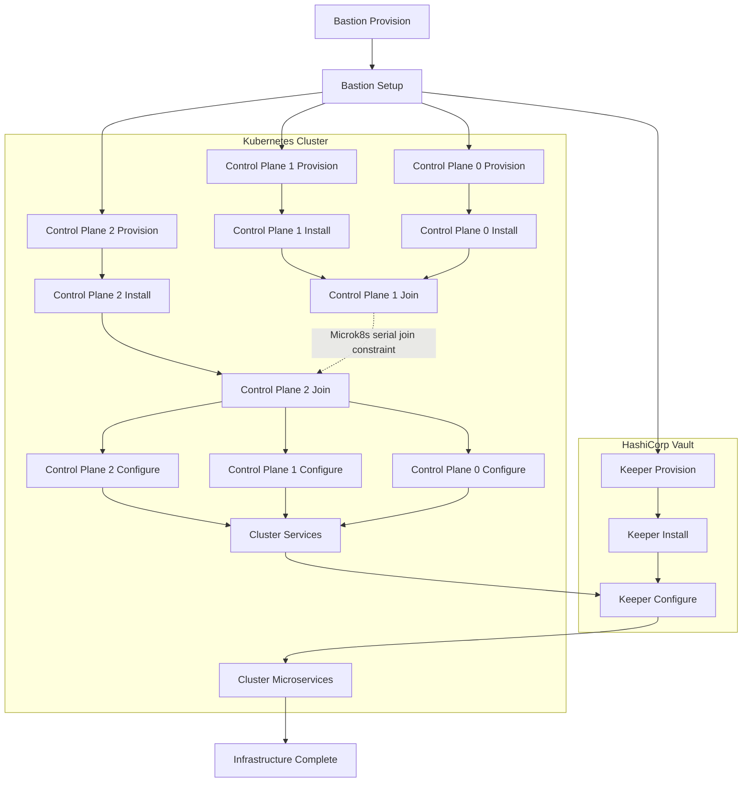

# Multi-environment Terraform

** Work in Progress**

Goal is to structure a directory that contains (with as little redundancy as possible) three environments (dev, test, prod) -- provisioning and configuring a three node VM-based Kubernetes cluster, and a LXC-containerized HashiCorp Vault. The _relatively_ straightforward process of associating a playbook with a single host in Terraform is extended here to replicate Ansible's complex orchestration capabilities across multiple hosts.  

While not without some contortions, it replicates the flow expressed in this [DAG](https://github.com/dekeyrej/terraform-forward/tree/main):
# DAG (Directed Acyclic Graph) of dependencies for Infrastructure

## Key parts of the solution:

### 0. 'locals-root'
  - 'playbooks': 
    - a short name
    - path to the actual ansible playbook
    - a list of tags existing in the playbook

### 1. envs directory - with subdirectories dev, test, prod (and creation).  Each contains:
  - locals/locals-{env}.tf which contains
    - 'vis' - a map describing the VMs and LXC-containers (hardware, OS, playbook, and playbook tags needed by the Virtual Instance)
    - 'dependencies' - a map of lists documenting [host].[ansible_playbook.tag].[dependencies]
  - playbooks/ansible_playbooks.tf - which is a python generated compendium of "ansible_playbook" resources for the environment

### 2. python 'builder-by-env.py'
  - 'builder-by-env.py' - class/script to read the locals (both locals-root.tf and envs/{env}/locals/local-{env}.tf), generating unique contexts for each host/playbook/tag combination which are then rendered against ansible_playbook.tf.j2

## Usage:

### Dev - 
- `tofu init -var="env=dev"`
- `tofu plan -var="env=dev"`
- `tofu apply -var="env=dev" -auto-approve`
- `tofu destroy -var="env=dev" -auto-approve`

### Test - 
- `tofu init -var="env=test"`
- `tofu plan -var="env=test"`
- `tofu apply -var="env=test" -auto-approve`
- `tofu destroy -var="env=test" -auto-approve`

And, well - you get the deal...

## Performance:

### Virtual Instances: 
- 3 x {4 core, 8GB RAM, 20GB SCSI0, Ubuntu 24.04-3 Server (latest image)}
- 1 x {2 core, 2GB RAM, 10GB SCSI0, Ubuntu 24.04-3 Server (custom image)} 

### On my homelab rig (AMD Ryzen 9 9950X, 128GB DDR5, NVME + SSD storage)
- `tofu apply -var="env=dev" -auto-approve` ~ 7m30s
- `tofu destroy -var="env=dev" -auto-approve` ~ 3s